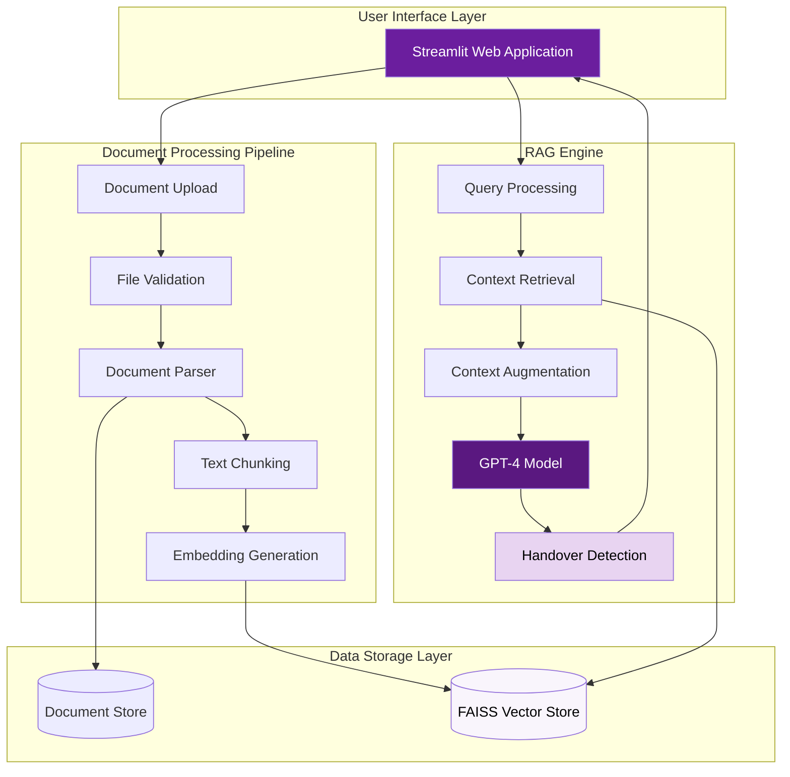
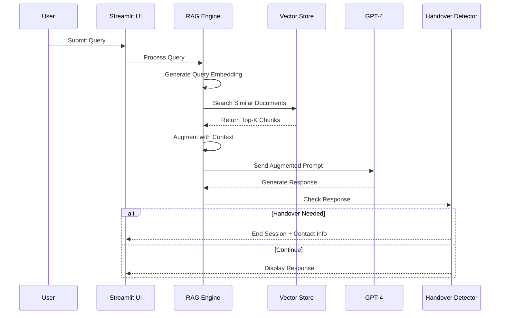
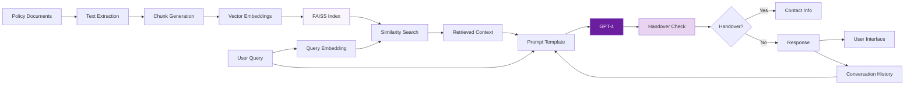

# Hollard AI Policy Assistant

A Retrieval-Augmented Generation (RAG) system designed to provide instant access to Hollard Insurance policies, products, claims procedures, and FAQs. Built with Streamlit, LangChain, and OpenAI GPT-4.

[](https://www.python.org/downloads/)
[](https://streamlit.io/)
[](https://www.langchain.com/)
[](#license)

---


## Table of Contents

- [Overview](#overview)
- [Features](#features)
- [System Architecture](#system-architecture)
- [Installation](#installation)
- [Configuration](#configuration)
- [Knowledge Base](#knowledge-base)
- [Usage](#usage)
- [Testing](#testing)
- [Deployment](#deployment)
- [Project Structure](#project-structure)
- [Technical Documentation](#technical-documentation)
- [Troubleshooting](#troubleshooting)
- [Contributing](#contributing)
- [License](#license)

---

## Overview

The Hollard AI Policy Assistant is an intelligent customer service tool designed for Hollard Insurance customers and staff. As one of South Africa's leading insurance providers, Hollard needed an efficient way to provide instant access to policy information, claims procedures, product details, and frequently asked questions.

This system uses advanced natural language processing to enable users to query insurance documentation through conversational interfaces, eliminating time spent searching through policy documents and manuals while ensuring accurate, contextual responses.

### Target Users

- Insurance Customers
- Customer Service Representatives
- Claims Processors
- Insurance Brokers
- Policy Administrators
- New Employee Onboarding

### Key Capabilities

- Natural language queries about insurance products
- Instant retrieval of claims procedures
- Quick access to policy terms and conditions
- FAQ responses and general insurance guidance
- Intelligent handover detection for complex requests
- Life insurance, disability, and business insurance information

---

## Features

### Core Functionality

**Intelligent Document Search**
- Vector-based semantic search across all insurance documentation
- FAISS (Facebook AI Similarity Search) for high-performance retrieval
- Context-aware responses using GPT-4
- Maintains conversation history for follow-up questions

**Knowledge Management**
- Multi-format document support (TXT, PDF, DOCX, Markdown)
- Automatic document validation and processing
- Vector store persistence for fast query response
- Atomic file operations to prevent data corruption

**Insurance Intelligence**
- Life insurance product information
- Disability and business insurance coverage
- Claims submission procedures
- Policy terms and conditions
- Company information and values
- Frequently asked questions

**Smart Handover Detection**
- Automatically detects when human assistance is needed
- Identifies purchase requests, complaints, and account changes
- Provides contact information for specialized support
- Prevents AI from handling sensitive customer transactions

### User Experience

**Professional Interface**
- Hollard corporate branding (Purple #6B1E9E)
- Clean, accessible design
- Responsive layout for desktop and mobile use
- Document management sidebar
- Session persistence with conversation history

**Session Management**
- Conversation history maintained throughout session
- Clear chat functionality for new queries
- Message display with user/assistant differentiation
- Automatic handover when human support is needed

---

## System Architecture

### High-Level Architecture



### RAG Pipeline Flow



### Data Flow



---

## Installation

### Prerequisites

- Python 3.11 or higher
- OpenAI API key with GPT-4 access
- Git
- Windows, macOS, or Linux operating system

### Step-by-Step Installation

**1. Clone the Repository**

```bash
git clone https://github.com/Kayanja2023/RAG-HOLLARD-AI-POLICY-ASSISTANT.git
cd RAG-HOLLARD-AI-POLICY-ASSISTANT
```

**2. Create Virtual Environment**

```bash
# Windows
python -m venv .venv
.venv\Scripts\activate

# macOS/Linux
python3 -m venv .venv
source .venv/bin/activate
```

**3. Install Dependencies**

```bash
pip install --upgrade pip
pip install -r requirements.txt
```

**4. Configure Environment Variables**

Create a `.env` file in the root directory:

```env
OPENAI_API_KEY=your_openai_api_key_here
```

**5. Verify Installation**

```bash
# Run tests to verify setup
python -m pytest tests/ -v
```

**6. Launch Application**

```bash
streamlit run app.py
```

The application will open in your default browser at `http://localhost:8501`

---

## Configuration

### Application Settings

Edit `config.py` to customize system behavior:

```python
# Document Processing Configuration
CHUNK_SIZE = 1000           # Characters per text chunk
CHUNK_OVERLAP = 200         # Overlap between consecutive chunks
MAX_FILE_SIZE = 52428800    # Maximum upload size (50MB)

# AI Model Configuration
MODEL = "gpt-4"             # OpenAI model identifier
TEMPERATURE = 0.7           # Response creativity (0.0 - 1.0)
SEARCH_K = 3                # Number of context chunks to retrieve

# File Support
ALLOWED_EXTENSIONS = ["txt", "pdf", "docx", "md"]
```

### Directory Structure

```python
DOCS_DIR = "data/documents"      # Knowledge base storage
FAISS_DIR = "data/faiss_store"   # Vector embeddings storage
```

### Environment Variables

| Variable | Required | Description |
|----------|----------|-------------|
| `OPENAI_API_KEY` | Yes | OpenAI API authentication key |
| `MODEL` | No | Override default GPT model |
| `TEMPERATURE` | No | Override default temperature |

---

## Knowledge Base

### Pre-Loaded Documentation

The system includes comprehensive Hollard Insurance documentation:

| Document | Content | Purpose |
|----------|---------|---------|
| `about-hollard.md` | Company history, values, Better Futures mission | Company information and culture |
| `claims-process.md` | Step-by-step claim submission, documentation requirements | Claims guidance and procedures |
| `hollard-faqs.md` | Common customer questions and answers | Quick reference for common queries |
| `hollard-products-overview.md` | Life, disability, business insurance products | Product information and coverage details |
| `life-insurance-basics.md` | Life insurance fundamentals, policy types, beneficiaries | Educational content for customers |

**Total Knowledge Base**: Approximately 13,000+ words covering Hollard's insurance products and services.

### Adding Documents

**Via User Interface:**
1. Navigate to sidebar "Knowledge Base Management"
2. Click "Upload Documents"
3. Select supported file formats
4. System automatically processes and indexes

**Via File System:**
1. Place files in `data/documents/` directory
2. Restart application to rebuild vector store

### Document Requirements

- **Supported Formats**: TXT, PDF, DOCX, MD
- **Maximum Size**: 50MB per file
- **Character Encoding**: UTF-8 recommended
- **Naming Convention**: Descriptive, lowercase with hyphens

---

## Usage

### Starting a Session

1. Launch application: `streamlit run app.py`
2. Verify documents are loaded (sidebar shows count)
3. Begin querying in the chat interface

### Example Queries

**Insurance Products**
- "What types of life insurance does Hollard offer?"
- "Tell me about disability insurance coverage"
- "What business insurance products are available?"

**Claims Process**
- "How do I submit a life insurance claim?"
- "What documents are needed for a claim?"
- "How long does the claims process take?"

**Policy Information**
- "What is the difference between term and whole life insurance?"
- "Who can be a beneficiary on my policy?"
- "How do premiums work for life insurance?"

**Company Information**
- "Tell me about Hollard's Better Futures initiative"
- "What is Hollard's history?"
- "What values does Hollard stand for?"

**FAQs**
- "When should I review my life insurance policy?"
- "Can I change my beneficiaries?"
- "What happens if I miss a premium payment?"

### Managing Conversations

**Clear Chat**: Reset conversation history for new topic
**Document Upload**: Add new policies to knowledge base
**Delete Documents**: Remove outdated files from system

### Handover Scenarios

The assistant automatically detects when human support is needed:

**Automatic Handover Triggers:**
- Purchase requests ("I want to buy insurance")
- Quote requests ("Give me a quote")
- Complaints or disputes
- Account changes or updates
- Complex personalized advice
- Policy cancellations

**What Happens:**
1. Assistant detects handover phrase in response
2. Session ends gracefully
3. Contact information displayed
4. User directed to appropriate channel

---

## Testing

### Test Suite Overview

The project includes comprehensive unit tests covering all core functionality:

| Test File | Coverage | Test Count |
|-----------|----------|------------|
| `test_config.py` | Configuration & file operations | 22 tests |
| `test_utils.py` | Text extraction utilities | 10 tests |
| `test_rag_engine.py` | RAG pipeline & document processing | 18 tests |
| `test_app_functions.py` | UI logic & session management | 19 tests |

### Running Tests

**All Tests**
```bash
python -m pytest tests/ -v
```

**Specific Test File**
```bash
python -m pytest tests/test_rag_engine.py -v
```

**With Coverage Report**
```bash
pip install pytest-cov
pytest tests/ --cov=. --cov-report=html
```

**Using unittest**
```bash
python -m unittest discover -s tests -p "test_*.py" -v
```

### Test Coverage

Current coverage: **75%+** across all modules

**Areas covered:**
- Configuration validation
- File I/O operations
- Document parsing (TXT, PDF, DOCX, MD)
- Vector embedding generation
- FAISS index operations
- Chat chain construction
- Handover detection logic
- Session state management
- Error handling and edge cases

---

## Deployment

### Streamlit Community Cloud

**Prerequisites**
- GitHub repository with code
- Streamlit Community Cloud account
- OpenAI API key

**Deployment Steps**

1. **Prepare Repository**
```bash
git add .
git commit -m "Prepare for deployment"
git push origin main
```

2. **Deploy Application**
- Navigate to https://share.streamlit.io
- Click "New app"
- Select repository: `Kayanja2023/RAG-HOLLARD-AI-POLICY-ASSISTANT`
- Branch: `main`
- Main file: `app.py`
- Click "Deploy"

3. **Configure Secrets**
- Open app settings in Streamlit dashboard
- Navigate to "Secrets"
- Add:
```toml
OPENAI_API_KEY = "sk-..."
```

4. **Verify Deployment**
- Access provided URL
- Test document loading
- Validate query responses
- Test handover detection

### Production Considerations

**Security**
- Implement authentication (Streamlit supports SSO)
- Restrict access to authorized users
- Use environment-specific API keys
- Enable HTTPS for data in transit
- Regular security audits

**Performance**
- Monitor OpenAI API usage and costs
- Implement rate limiting for queries
- Cache frequently accessed responses
- Regular vector store optimization
- Load testing for concurrent users

**Maintenance**
- Schedule regular document updates
- Monitor application logs
- Track query patterns for improvement
- Backup vector store periodically
- Update dependencies regularly

**Compliance**
- Ensure POPIA compliance for customer data
- Regular privacy policy reviews
- Data retention policies
- Audit trails for sensitive queries

---

## Project Structure

```
RAG-HOLLARD-AI-POLICY-ASSISTANT/
├── app.py                      # Main Streamlit application
├── rag_engine.py              # RAG pipeline implementation
├── config.py                  # Configuration management
├── utils.py                   # Text extraction utilities
├── requirements.txt           # Python dependencies
├── .env                       # Environment variables (not in repo)
├── .gitignore                # Git exclusions
├── README.md                 # This file
├── DOCUMENTATION.md          # Technical deep-dive
│
├── data/
│   ├── documents/            # Knowledge base files
│   │   ├── about-hollard.md
│   │   ├── claims-process.md
│   │   ├── hollard-faqs.md
│   │   ├── hollard-products-overview.md
│   │   ├── life-insurance-basics.md
│   │   └── README.md
│   │
│   └── faiss_store/          # Vector embeddings
│       ├── index.faiss       # FAISS index file
│       └── index.pkl         # Metadata pickle
│
├── tests/
│   ├── __init__.py
│   ├── test_config.py        # Configuration tests
│   ├── test_utils.py         # Utility function tests
│   ├── test_rag_engine.py    # RAG pipeline tests
│   ├── test_app_functions.py # UI logic tests
│   └── README.md             # Testing documentation
│
└── assets/                   # Static resources (logos, images)
```

---

## Technical Documentation

### Core Technologies

| Component | Technology | Version | Purpose |
|-----------|-----------|---------|---------|
| Frontend | Streamlit | 1.22+ | Web application framework |
| LLM | OpenAI GPT-4 | Latest | Natural language generation |
| Embeddings | OpenAI text-embedding-3-small | Latest | Text vectorization |
| Vector Store | FAISS | 1.7.4+ | Similarity search engine |
| Framework | LangChain | 0.3.9 | RAG pipeline orchestration |
| Language | Python | 3.11+ | Core programming language |

### RAG Implementation Details

**Document Processing**
1. Upload validation (size, format, duplicates)
2. Text extraction using format-specific loaders
3. Recursive character-based text splitting
4. Chunk size: 1000 characters with 200-character overlap
5. Embedding generation via OpenAI API
6. FAISS index creation and persistence

**Query Processing**
1. User input received via Streamlit chat
2. Query embedding generation
3. FAISS similarity search (top-k=3)
4. Context retrieval from matched chunks
5. Prompt template augmentation with context
6. GPT-4 response generation with Hollard context
7. Handover detection analysis
8. Response display or session termination

**Memory Management**
- Session state stores conversation history
- ChatMessageHistory maintains message sequencing
- RunnableWithMessageHistory enables context continuity
- Clear chat resets session state

**Handover Logic**
- System prompt includes handover instructions
- Specific phrase triggers: `[HANDOVER_TO_HUMAN]`
- Detects purchase, quote, complaint, account change requests
- Gracefully ends session with contact information

### Performance Characteristics

- **Embedding Generation**: ~100ms per document chunk
- **Vector Search**: <10ms for top-k retrieval
- **LLM Response**: 1-3 seconds depending on complexity
- **Document Upload**: 2-5 seconds processing per file
- **Concurrent Users**: Supports multiple sessions via Streamlit

---

## Troubleshooting

### Common Issues

**Issue: ModuleNotFoundError**
```bash
# Solution: Reinstall dependencies
pip install -r requirements.txt
```

**Issue: OpenAI Authentication Error**
```bash
# Solution: Verify API key in .env file
OPENAI_API_KEY=sk-your-actual-key-here
```

**Issue: FAISS Import Error**
```bash
# Solution: Install CPU version of FAISS
pip uninstall faiss-gpu
pip install faiss-cpu
```

**Issue: Documents Not Loading**
- Verify files exist in `data/documents/`
- Check file extensions are supported
- Ensure file sizes are under 50MB
- Review file encoding (use UTF-8)
- Check file permissions

**Issue: Vector Store Not Updating**
```bash
# Solution: Clear and rebuild
# Delete data/faiss_store/ directory
# Restart application
streamlit run app.py
```

**Issue: Slow Query Response**
- Check OpenAI API status
- Verify internet connectivity
- Consider reducing SEARCH_K value
- Monitor API rate limits
- Check for large document chunks

**Issue: Memory Errors**
- Reduce CHUNK_SIZE in config.py
- Clear vector store and rebuild
- Process large documents in batches
- Restart Streamlit server

**Issue: Handover Not Triggering**
- Verify system prompt includes handover logic
- Check for `[HANDOVER_TO_HUMAN]` phrase
- Review GPT-4 response formatting
- Test with explicit trigger phrases

### Logging and Debugging

Enable detailed logging in `app.py`:
```python
import logging
logging.basicConfig(level=logging.DEBUG)
```

Check Streamlit logs:
```bash
streamlit run app.py --logger.level=debug
```

View error traces:
- Check browser console for JavaScript errors
- Review terminal output for Python exceptions
- Enable Streamlit debug mode in settings

---

## Contributing

### Development Workflow

**1. Create Feature Branch**
```bash
git checkout -b feature/your-feature-name
```

**2. Implement Changes**
- Follow PEP 8 style guidelines
- Add docstrings to all functions
- Include type hints where appropriate
- Write unit tests for new functionality

**3. Run Tests**
```bash
python -m pytest tests/ -v
```

**4. Commit Changes**
```bash
git add .
git commit -m "Feature: Description of changes"
```

**5. Push and Create Pull Request**
```bash
git push origin feature/your-feature-name
```

### Code Standards

**Python Style**
- Follow PEP 8 conventions
- Maximum line length: 100 characters
- Use meaningful variable names
- Add comments for complex logic
- Type hints for function parameters

**Documentation**
- Docstrings for all functions and classes
- Update README for user-facing changes
- Maintain DOCUMENTATION.md for technical details
- Include inline comments for complex algorithms

**Testing**
- Minimum 75% code coverage
- Test both success and failure cases
- Mock external API calls (OpenAI)
- Use descriptive test names
- Test edge cases and error handling

### Enhancement Ideas

**Potential Features:**
- Multi-language support (Afrikaans, Zulu, Xhosa)
- Voice input for accessibility
- Document version control
- Analytics dashboard for common queries
- Integration with Hollard CRM systems
- Automated document updates from policy systems
- Advanced user authentication
- Query suggestions and autocomplete

---


## Acknowledgments

Developed for Hollard Insurance to enhance customer service efficiency and knowledge accessibility.

**Technology Partners**
- OpenAI for GPT-4 and embedding models
- LangChain for RAG framework
- Streamlit for web application platform
- Facebook AI Research for FAISS vector search

**Hollard Values**
This assistant embodies Hollard's commitment to innovation, customer service excellence, and the Better Futures mission.

---

**Version**: 1.0.0  
**Last Updated**: December 2024  
**Maintained By**: Hollard IT Development Team  
**Deployment**: Streamlit Community Cloud  
**Repository**: https://github.com/Kayanja2023/RAG-HOLLARD-AI-POLICY-ASSISTANT
