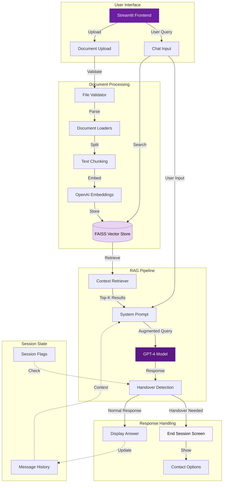

# Hollard Policy Assistant 🛡️

A Retrieval-Augmented Generation (RAG) chatbot designed to help users get instant answers about Hollard Insurance products, policies, and claims procedures. Built with Streamlit, LangChain, and OpenAI GPT-4.

[](https://www.python.org/downloads/)
[](https://streamlit.io/)
[](https://www.langchain.com/)
[](#testing)
[](#test-coverage)

---

## 📖 Table of Contents

- [Features](#-features)
- [System Architecture](#-system-architecture)
- [Quick Start](#-quick-start)
- [Configuration](#-configuration)
- [Knowledge Base](#-knowledge-base)
- [Testing](#-testing)
- [Deployment](#-deployment)
- [Project Structure](#-project-structure)
- [Contributing](#-contributing)

---

## ✨ Features

### Core Functionality
- **💬 Intelligent Chat Interface**: Ask questions about Hollard products, claims, and policies in natural language
- **📚 RAG-Powered Responses**: Uses FAISS vector search to retrieve relevant information from knowledge base
- **🔄 Conversation Memory**: Maintains context throughout the conversation for more natural interactions
- **📱 Responsive UI**: Clean, mobile-friendly interface with Hollard branding

### Smart Features
- **🤝 Handover Mechanism**: Automatically detects when human assistance is needed (quotes, purchases, complaints)
- **🛡️ Session Management**: Ends session gracefully when handover is triggered, displays contact information
- **📄 Multi-Format Support**: Processes TXT, PDF, DOCX, and Markdown documents
- **🎨 Hollard Branding**: Purple-themed UI with official Hollard logo and Better Futures mission alignment

### Knowledge Base
The assistant has knowledge about:
- Life Insurance, Disability Cover, Critical Illness Insurance
- Short-term Insurance (Car, Home, Business)
- Claims procedures and required documentation
- Company information and Better Futures initiative
- Broker network and how to find assistance

---

## 🏗️ System Architecture



### Data Flow

1. **Document Ingestion**: User uploads policy documents → Validated → Chunked → Embedded → Stored in FAISS
2. **Query Processing**: User question → Vector search → Top-K relevant chunks retrieved
3. **Context Augmentation**: Retrieved chunks + conversation history + system prompt → GPT-4
4. **Response Generation**: GPT-4 generates answer → Handover detection → Display or end session
5. **Memory Management**: All messages stored in session state for conversation continuity

---

## 🚀 Quick Start

### Prerequisites

- Python 3.11 or higher
- OpenAI API key
- Git

### Installation

1. **Clone the repository**
```bash
git clone https://github.com/Kayanja2023/Rag.git
cd Rag
```

2. **Create virtual environment**
```bash
python -m venv .venv
.venv\Scripts\activate  # Windows
# source .venv/bin/activate  # Mac/Linux
```

3. **Install dependencies**
```bash
pip install -r requirements.txt
```

4. **Set up environment variables**
```bash
# Create .env file
echo OPENAI_API_KEY=your_api_key_here > .env
```

5. **Run the application**
```bash
streamlit run app.py
```

The app will open in your browser at `http://localhost:8501`

---

## ⚙️ Configuration

Edit `config.py` to customize settings:

```python
# Document Processing
CHUNK_SIZE = 1000          # Characters per chunk
CHUNK_OVERLAP = 200        # Overlap between chunks
MAX_FILE_SIZE = 50 * 1024 * 1024  # 50MB limit

# Model Settings
MODEL = "gpt-4"            # OpenAI model
TEMPERATURE = 0.7          # Response creativity (0-1)
SEARCH_K = 3               # Number of chunks to retrieve

# Supported formats
ALLOWED_EXTENSIONS = ["txt", "pdf", "docx", "md"]
```

---

## 📚 Knowledge Base

The assistant comes pre-loaded with 5 comprehensive documents:

| Document | Content | Word Count |
|----------|---------|------------|
| `hollard-products-overview.md` | All insurance products (Life, Disability, Business, etc.) | ~2,800 |
| `hollard-faqs.md` | Frequently asked questions from website | ~1,800 |
| `life-insurance-basics.md` | Complete guide to life insurance | ~3,500 |
| `claims-process.md` | Step-by-step claim procedures | ~3,000 |
| `about-hollard.md` | Company info, Better Futures mission | ~2,200 |

**Total Knowledge Base**: ~13,000 words covering Hollard's products, services, and processes.

### Adding Documents

1. Upload via the sidebar in the app
2. Or manually place files in `data/documents/`
3. Restart app to rebuild vector store

---

## 🧪 Testing

### Run All Tests

```bash
# Using unittest
python -m unittest discover -s tests -p "test_*.py" -v

# Run specific test file
python -m unittest tests.test_config -v
```

### Test Coverage

```bash
# Run tests with coverage
python -m coverage run --source=. -m unittest discover -s tests -p "test_*.py"

# View report in terminal
python -m coverage report

# Generate HTML report
python -m coverage html
start htmlcov\index.html  # Windows
```

**Current Coverage**: 77% (669/869 statements)

### Test Suite Breakdown

- **test_config.py** (22 tests): Configuration validation, file operations, atomic writes
- **test_utils.py** (10 tests): Text extraction from various formats
- **test_rag_engine.py** (18 tests): Document loading, embeddings, vector store
- **test_app_functions.py** (19 tests): Handover detection, session management, UI logic

---

## 🚀 Deployment

### Deploy to Streamlit Community Cloud

1. **Push to GitHub**
```bash
git push origin feature/policy-assistant-poc
# Or merge to main first
```

2. **Deploy on Streamlit**
   - Go to https://share.streamlit.io/
   - Click "New app"
   - Select repository: `Kayanja2023/Rag`
   - Branch: `feature/policy-assistant-poc` (or `main`)
   - Main file: `app.py`
   - Click "Deploy"

3. **Add Secrets**
   - In Streamlit Cloud dashboard
   - Go to app settings → Secrets
   - Add: `OPENAI_API_KEY = "your_key_here"`

### Environment Variables

Required:
- `OPENAI_API_KEY`: Your OpenAI API key

Optional:
- `DOCS_DIR`: Custom document directory path
- `FAISS_DIR`: Custom vector store path

---

## 📁 Project Structure

```
Rag/
├── app.py                          # Main Streamlit application
├── rag_engine.py                   # RAG pipeline and chat chain
├── config.py                       # Configuration settings
├── utils.py                        # Text extraction utilities
├── requirements.txt                # Python dependencies
├── .env                           # Environment variables (not in repo)
├── .gitignore                     # Git ignore rules
│
├── data/
│   ├── documents/                 # Knowledge base files
│   │   ├── hollard-products-overview.md
│   │   ├── hollard-faqs.md
│   │   ├── life-insurance-basics.md
│   │   ├── claims-process.md
│   │   └── about-hollard.md
│   └── faiss_store/              # Vector embeddings
│       └── index.faiss
│
├── tests/
│   ├── __init__.py
│   ├── test_config.py            # Config & file operation tests
│   ├── test_utils.py             # Utility function tests
│   ├── test_rag_engine.py        # RAG pipeline tests
│   ├── test_app_functions.py     # UI logic tests
│   └── README.md                 # Test documentation
│
└── assets/
    └── pngegg.jpg                # Hollard logo (fallback)
```

---

## 🔧 How It Works

### RAG Pipeline Explained

1. **Document Loading**
   - Files uploaded via UI or placed in `data/documents/`
   - Loaded using LangChain loaders (TextLoader, PyPDFLoader, Docx2txtLoader)
   
2. **Text Chunking**
   - Documents split into 1000-character chunks with 200-char overlap
   - Ensures context continuity across chunks
   
3. **Embedding Generation**
   - Each chunk converted to vector using OpenAI's `text-embedding-3-small`
   - Stored in FAISS for fast similarity search
   
4. **Query Processing**
   - User question embedded to vector
   - FAISS finds top-3 most similar chunks
   
5. **Context Augmentation**
   - Retrieved chunks + conversation history + system prompt
   - Sent to GPT-4 for answer generation
   
6. **Response Handling**
   - GPT-4 response checked for handover triggers
   - Normal response: displayed in chat
   - Handover needed: session ends, contact info shown

### Handover Mechanism

The system detects when questions require human assistance:

**Triggers**:
- Requesting quotes or purchases
- Account-specific queries
- Claim submissions
- Complaints or urgent issues
- Policy changes

**Detection phrases**:
- "connect you with"
- "hand you over"
- "live agent"
- "Hollard specialist"

**Action**: Session ends, displays contact card with:
- Phone: 0860 103 933
- Email: info@hollard.co.za
- Broker finder link

---

## 🎨 UI Features

### Hollard Branding
- **Colors**: Purple (#6B1E9E), Light Purple (#E8D4F1), White
- **Logo**: Official Hollard SVG from website
- **Tagline**: "Your Policy Knowledge Partner"
- **Icon**: 🛡️ (shield emoji)

### User Experience
- **Welcome Cards**: Contextual welcome based on app state
- **Loading States**: Spinner during document analysis
- **Clear Chat**: Reset conversation anytime
- **Disabled States**: Chat disabled when no documents loaded
- **Session End**: Clean handover screen with contact options

---

## 🛠️ Tech Stack

| Category | Technology |
|----------|-----------|
| **Frontend** | Streamlit 1.30+ |
| **LLM** | OpenAI GPT-4 |
| **Embeddings** | OpenAI text-embedding-3-small |
| **Vector Store** | FAISS |
| **Framework** | LangChain |
| **Language** | Python 3.11+ |
| **Testing** | unittest, coverage |
| **Document Parsing** | PyPDF2, python-docx, pdfplumber |

---

## 🤝 Contributing

### Development Workflow

1. **Create feature branch**
```bash
git checkout -b feature/your-feature-name
```

2. **Make changes and test**
```bash
python -m unittest discover -s tests
```

3. **Commit with descriptive message**
```bash
git add .
git commit -m "Feature: Add new functionality"
```

4. **Push and create PR**
```bash
git push origin feature/your-feature-name
```

### Code Style

- Follow PEP 8 guidelines
- Add docstrings to functions
- Write tests for new features
- Keep functions focused and small

---

## 📝 License

This project is for demonstration purposes. Hollard Insurance branding and content are property of Hollard Insurance Company.

---

## 🐛 Troubleshooting

### Common Issues

**Issue**: `ModuleNotFoundError: No module named 'openai'`
```bash
pip install -r requirements.txt
```

**Issue**: `ValueError: not enough values to unpack`
- Usually caused by Streamlit version mismatch
- Run: `pip install --upgrade streamlit`

**Issue**: No documents showing in sidebar
- Check `data/documents/` folder exists
- Verify files are .txt, .pdf, .docx, or .md
- Check file permissions

**Issue**: Vector store not updating
- Delete `data/faiss_store/` folder
- Restart app to rebuild

**Issue**: OpenAI API errors
- Verify API key in `.env` file
- Check API quota/billing
- Ensure stable internet connection

---

## 📞 Support

For issues related to:
- **Application bugs**: Open a GitHub issue
- **Hollard products**: Contact Hollard at 0860 103 933
- **Insurance queries**: Use the broker finder at hollard.co.za/broker-tool

---

## 🎯 Roadmap

Future enhancements:
- [ ] Add callback form with email notifications
- [ ] Implement live chat integration
- [ ] Add analytics dashboard
- [ ] Support for more document formats
- [ ] Multi-language support
- [ ] Voice input capability
- [ ] Mobile app version

---

## 👨‍💻 Author

Built by a junior developer learning RAG applications and insurance domain chatbots.

**Repository**: https://github.com/Kayanja2023/Rag  
**Branch**: feature/policy-assistant-poc

---

Made with ❤️ for Better Futures
